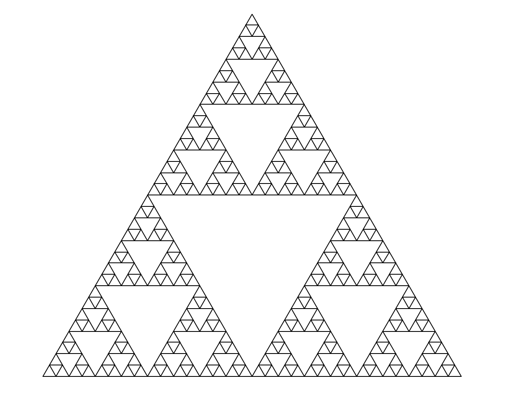
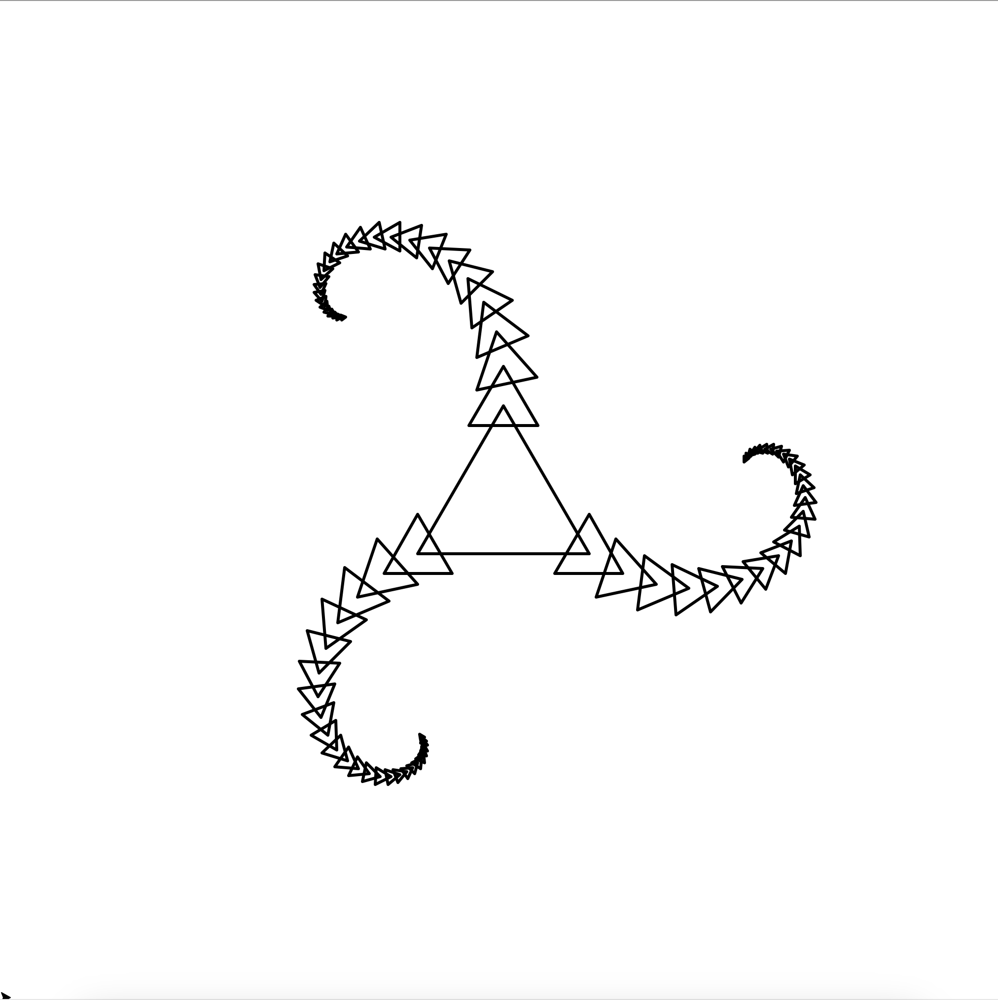
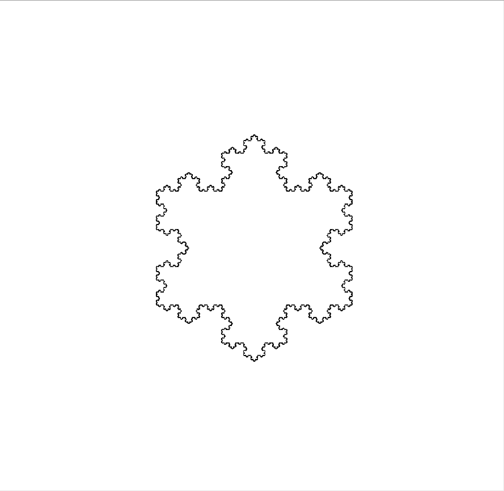
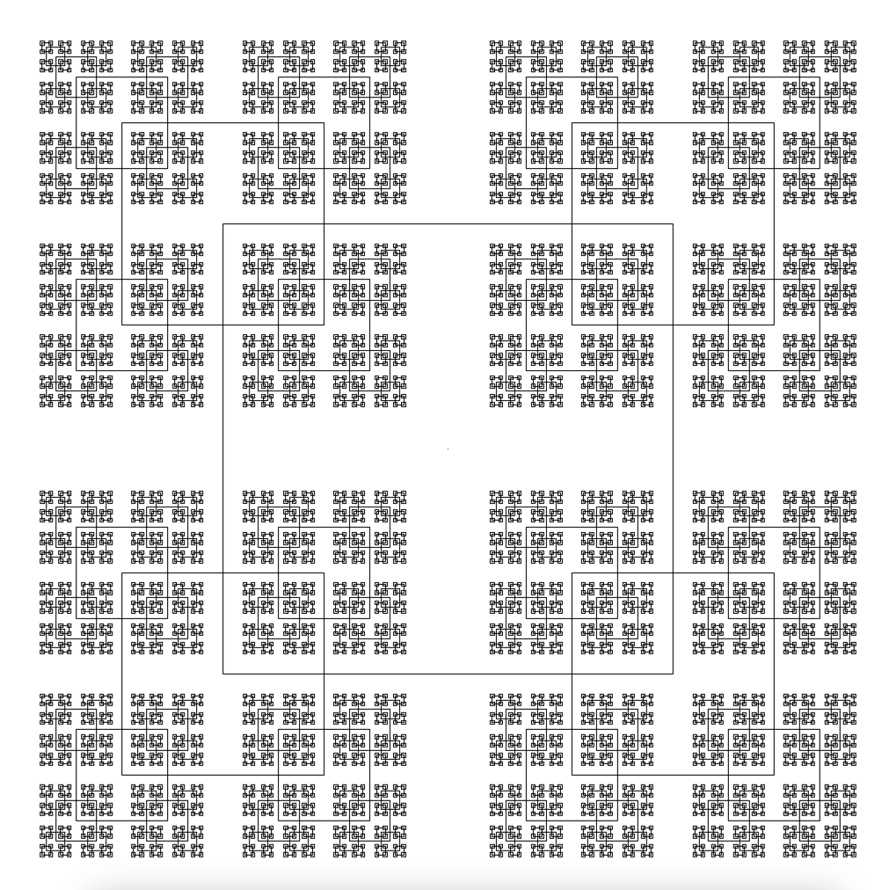
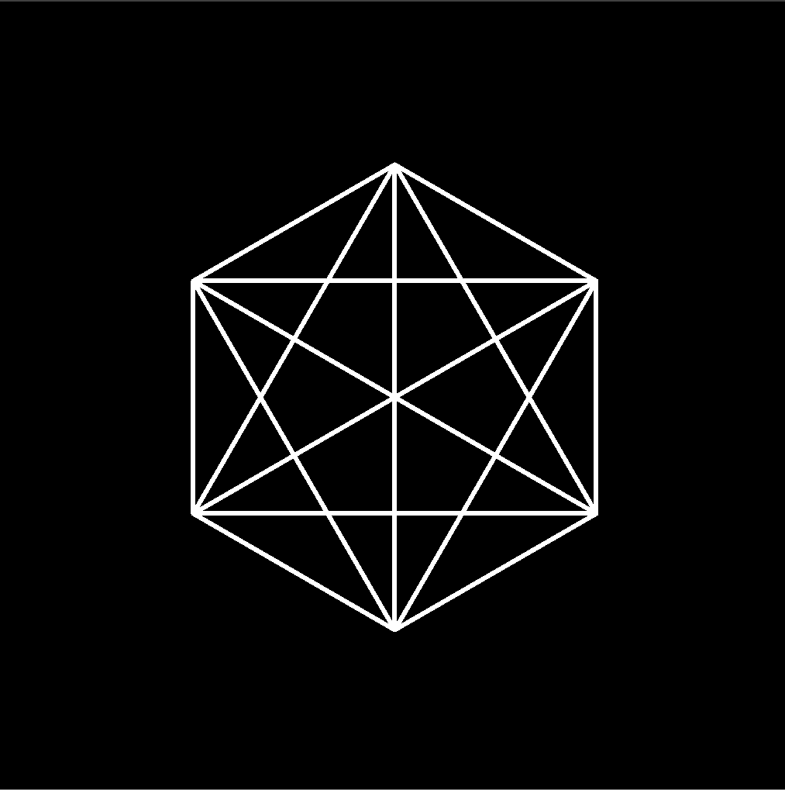
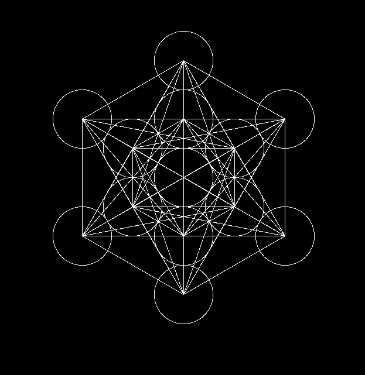

These are the fractals (and other interesting things, in general) I've drawn so far. I may work on making more.\
To use these, run them as executables and pass in a single argument, an integer denoting the number of iterations you would like to draw these fractals to.\
Example usage: `./sierpinski 6`

## Sierpinski

## Triangle Spiral
I haven't been able to identify this fractal, as this is one I thought of independently. I'm sure a name has already been coined, but until then I will simply refer to it as a "Triangle Spiral" fractal.

## Koch Snowflake

## Square

## Complete Graph

## Metatron's Cube
